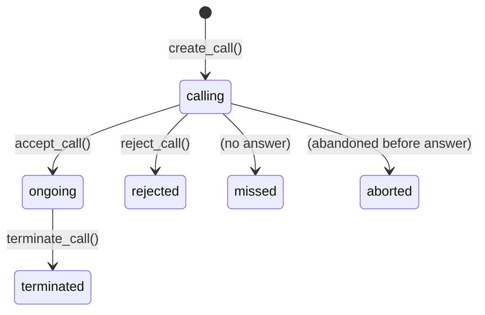

The `voip_oca` module provides two models for managing VoIP calls through Odoo: `voip.pbx` stores PBX server configuration, and `voip.call` records individual call events and exposes lifecycle methods consumed by the frontend VOIP widget.

---

## voip.pbx

`voip.pbx` stores connection details for a SIP/WebSocket PBX server. Users are linked to a PBX via `res.users.voip_pbx_id`.

### Fields

<ParamField path="name" type="string" required>
  Human-readable label for this PBX configuration, displayed in the user's VOIP settings.
</ParamField>

<ParamField path="domain" type="string" default="localhost">
  Hostname or IP address of the PBX server. Used by the SIP stack to build the SIP URI.
</ParamField>

<ParamField path="ws_server" type="string" default="ws://localhost">
  WebSocket server URL (including scheme) for the SIP WebSocket transport. For production deployments this is typically a `wss://` address.
</ParamField>

<ParamField path="mode" type="string" default="test">
  Environment mode. Accepted values:

  - `"test"` — the frontend operates in test mode; no real calls are placed.
  - `"prod"` — production mode; calls are originated over the real PBX.

  The effective mode exposed to the frontend via `res.users._voip_get_info()` falls back to `"test"` if the user has no `voip_username` or `voip_password` configured, regardless of this field's value.
</ParamField>

---

## voip.call

`voip.call` records each call event initiated or received through the VOIP widget. Records are owned by the Odoo user (`user_id`) who handled the call.

### Fields

<ParamField path="phone_number" type="string" required>
  The phone number involved in the call, stored exactly as dialed or received.
</ParamField>

<ParamField path="type_call" type="string" default="outgoing">
  Direction of the call. One of:

  - `"incoming"` — call originated from the remote party.
  - `"outgoing"` — call initiated by the Odoo user.
</ParamField>

<ParamField path="state" type="string" default="calling">
  Current state in the call lifecycle. See the state machine below.
</ParamField>

<ParamField path="pbx_id" type="voip.pbx (Many2one)">
  The PBX server through which this call is routed. Optional — may be left unset for calls that do not go through a managed PBX.
</ParamField>

<ParamField path="start_date" type="datetime">
  Timestamp set when the call is accepted (state transitions to `"ongoing"`). Represents the moment the parties are connected.
</ParamField>

<ParamField path="end_date" type="datetime">
  Timestamp set when the call ends (state transitions to `"terminated"` or `"rejected"`).
</ParamField>

<ParamField path="partner_id" type="res.partner (Many2one)">
  The contact associated with this call. Populated automatically by `create_call` if a partner with a matching `phone` or `mobile` is found.
</ParamField>

<ParamField path="user_id" type="res.users (Many2one)" default="current user">
  The Odoo user responsible for this call. Defaults to `env.uid` at record creation.
</ParamField>

<ParamField path="activity_name" type="string">
  Optional name of the scheduled activity linked to this call (e.g. a call activity on a CRM lead). Used as a search field in `get_recent_calls`.
</ParamField>

---

### State machine

A `voip.call` record starts in `"calling"` and transitions through the following states:



| State | Description |
|---|---|
| `calling` | Initial state. The call has been initiated but not yet answered. |
| `ongoing` | The call was accepted; both parties are connected. `start_date` is set. |
| `terminated` | The call ended normally. `end_date` is set. |
| `rejected` | The callee explicitly rejected the incoming call. `end_date` is set. |
| `missed` | The call was not answered (no explicit rejection). |
| `aborted` | The caller hung up before the call was answered. |

<Note>
  The `missed` and `aborted` states are not set by the Python lifecycle methods below — they are typically set by the frontend widget or by IPBX webhook handlers that detect unanswered calls after a timeout.
</Note>

---

## Methods

### `create_call`

<ParamField path="values" type="dict" required>
  A dictionary of field values for the new `voip.call` record. At minimum, `phone_number` must be provided. If `partner_id` is absent or falsy, the method performs an automatic partner lookup.

  <Expandable title="values keys">
    <ResponseField name="phone_number" type="string" required>
      The phone number for this call.
    </ResponseField>
    <ResponseField name="type_call" type="string">
      `"incoming"` or `"outgoing"`. Defaults to `"outgoing"`.
    </ResponseField>
    <ResponseField name="pbx_id" type="integer">
      ID of the `voip.pbx` record. Optional.
    </ResponseField>
    <ResponseField name="partner_id" type="integer">
      ID of the `res.partner` record. When absent, an automatic lookup is performed against `partner.phone` and `partner.mobile`.
    </ResponseField>
    <ResponseField name="activity_name" type="string">
      Name of the related activity, if any.
    </ResponseField>
  </Expandable>
</ParamField>

**Returns** `dict` — the `format_call()` output for the newly created record.

When `partner_id` is not supplied in `values`, the method searches `res.partner` for an exact match on `phone` or `mobile`:

```python
self.env["res.partner"].search(
    ["|",
     ("phone", "=", values.get("phone_number")),
     ("mobile", "=", values.get("phone_number"))],
    limit=1,
)
```

```python
call_data = self.env["voip.call"].create_call({
    "phone_number": "+33142000102",
    "type_call": "outgoing",
})
# {'id': 7, 'state': 'calling', 'partner': {'id': 42, ...}, ...}
```

---

### `get_recent_calls`

<ParamField path="_search" type="string">
  Optional search string. When provided, results are filtered to records where `phone_number`, `partner_id.name`, or `activity_name` contains this string (case-insensitive `ilike`). Pass `None` or an empty string to return all calls for the current user.
</ParamField>

<ParamField path="offset" type="integer" required>
  Number of records to skip. Use for pagination.
</ParamField>

<ParamField path="limit" type="integer" required>
  Maximum number of records to return.
</ParamField>

**Returns** `list[dict]` — a list of `format_call()` dicts, ordered by `create_date DESC` (most recent first). Results are always scoped to the current user (`user_id = env.uid`).

```python
calls = self.env["voip.call"].get_recent_calls("Akretion", offset=0, limit=10)
# [{'id': 7, 'state': 'terminated', 'displayName': 'Terminated - Akretion France', ...}, ...]
```

---

### `format_call`

No parameters. Called on a single record.

**Returns** `dict`

Serializes the call record into a JSON-safe dictionary for consumption by the frontend widget.

<ResponseField name="id" type="integer" required>
  Database ID of the `voip.call` record.
</ResponseField>

<ResponseField name="creationDate" type="datetime">
  Timestamp when the record was created (`create_date`). Identical to `createDate`.
</ResponseField>

<ResponseField name="createDate" type="datetime">
  Same as `creationDate`. Both keys are returned for compatibility.
</ResponseField>

<ResponseField name="typeCall" type="string">
  Call direction: `"incoming"` or `"outgoing"`.
</ResponseField>

<ResponseField name="displayName" type="string">
  Computed display name in the form `"{State label} - {partner name or phone number}"`, e.g. `"Ongoing - Akretion France"`.
</ResponseField>

<ResponseField name="startDate" type="datetime">
  Timestamp when the call was accepted. `None` if the call has not been answered.
</ResponseField>

<ResponseField name="endDate" type="datetime">
  Timestamp when the call ended. `None` if the call is still active.
</ResponseField>

<ResponseField name="partner" type="object">
  The linked partner serialized via `res.partner.format_partner()`, or `None` if no partner is associated.

  <Expandable title="partner properties">
    <ResponseField name="id" type="integer">
      Partner record ID.
    </ResponseField>
    <ResponseField name="type" type="string">
      Always `"partner"`.
    </ResponseField>
    <ResponseField name="name" type="string">
      Partner name.
    </ResponseField>
    <ResponseField name="displayName" type="string">
      Partner display name (may include company name).
    </ResponseField>
    <ResponseField name="email" type="string">
      Partner email address, or `null`.
    </ResponseField>
    <ResponseField name="landlineNumber" type="string">
      The `phone` field value, or `null`.
    </ResponseField>
    <ResponseField name="mobileNumber" type="string">
      The `mobile` field value, or `null`.
    </ResponseField>
  </Expandable>
</ResponseField>

<ResponseField name="phoneNumber" type="string">
  The raw phone number stored on the call record.
</ResponseField>

<ResponseField name="state" type="string">
  Current state: `"aborted"`, `"calling"`, `"missed"`, `"ongoing"`, `"rejected"`, or `"terminated"`.
</ResponseField>

---

### `terminate_call`

No parameters. Called on a single record.

**Returns** `dict` — `format_call()` output after the state change.

Sets `end_date` to the current datetime and transitions `state` to `"terminated"`. Use this when the call ends normally (either party hangs up after connection).

```python
call = self.env["voip.call"].browse(7)
result = call.terminate_call()
# {'id': 7, 'state': 'terminated', 'endDate': datetime(...), ...}
```

---

### `accept_call`

No parameters. Called on a single record.

**Returns** `dict` — `format_call()` output after the state change.

Sets `start_date` to the current datetime and transitions `state` to `"ongoing"`. Call this when the Odoo user picks up an incoming call or when an outgoing call is answered by the remote party.

```python
call = self.env["voip.call"].browse(7)
result = call.accept_call()
# {'id': 7, 'state': 'ongoing', 'startDate': datetime(...), ...}
```

---

### `reject_call`

No parameters. Called on a single record.

**Returns** `dict` — `format_call()` output after the state change.

Sets `end_date` to the current datetime and transitions `state` to `"rejected"`. Use this when the Odoo user explicitly declines an incoming call.

```python
call = self.env["voip.call"].browse(7)
result = call.reject_call()
# {'id': 7, 'state': 'rejected', 'endDate': datetime(...), ...}
```

---

## res.partner extensions (voip_oca)

`voip_oca` extends `res.partner` with two methods used by the frontend widget.

### `format_partner()`

No parameters. Called on a single partner record.

**Returns** `dict` — a JSON-safe partner object consumed by the softphone components.

```python
{
    "id": 42,
    "type": "partner",
    "displayName": "Akretion France",
    "email": "contact@akretion.com",
    "landlineNumber": "+33 1 42 00 01 02",   # from partner.phone
    "mobileNumber": "+33 6 12 34 56 78",      # from partner.mobile
    "name": "Akretion France",
}
```

### `voip_get_contacts(_search, offset, limit)`

<ParamField path="_search" type="string">
  Optional search string. Filters by `name`, `phone`, `mobile`, or `email` (case-insensitive `ilike`).
</ParamField>
<ParamField path="offset" type="integer" required>
  Number of records to skip for pagination.
</ParamField>
<ParamField path="limit" type="integer" required>
  Maximum number of records to return.
</ParamField>

**Returns** `list[dict]` — a list of `format_partner()` dicts for partners that have at least one of `phone` or `mobile` set.

```python
contacts = self.env["res.partner"].voip_get_contacts("Akretion", offset=0, limit=13)
# [{'id': 42, 'type': 'partner', 'name': 'Akretion France', ...}, ...]
```

---

## mail.activity extensions (voip_oca)

### `get_call_activities(_search, offset, limit)`

<ParamField path="_search" type="string">
  Optional search string. Filters by `res_name`, `summary`, or `date_deadline` (case-insensitive `ilike`).
</ParamField>
<ParamField path="offset" type="integer" required>
  Pagination offset.
</ParamField>
<ParamField path="limit" type="integer" required>
  Maximum records to return.
</ParamField>

**Returns** `list[dict]` — the result of `activity_format()` for matching activities. Filters to:
- Activity type with `category = "phonecall"`
- Assigned to the current user
- `date_deadline <= now()`
- Records the user has read access to (multi-company safe)

```python
activities = self.env["mail.activity"].get_call_activities("", offset=0, limit=13)
```
