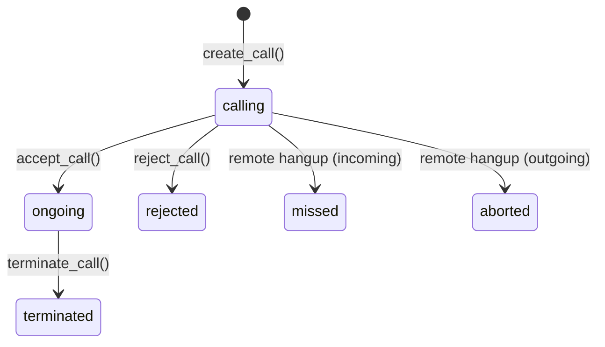

`voip_oca` embeds a full SIP softphone into the Odoo 18 backend. It connects the browser directly to your PBX via WebSocket (RFC 7118) using [SIP.js](https://sipjs.com/), so no Odoo server involvement is needed during the actual call. The module records call history, surfaces call activities, and provides in-widget contact access. It explicitly excludes and replaces the official `voip` Odoo Enterprise module.

**Version:** 18.0.1.0.2 · **License:** AGPL-3 · **Excludes:** `voip`

<CardGroup cols={2}>
  <Card title="Browser-native WebRTC" icon="globe">
    SIP.js negotiates media directly between the browser and PBX. The Odoo server stores credentials and call records but is not in the call path.
  </Card>
  <Card title="Call history" icon="clock-rotate-left">
    Every call is recorded as a `voip.call` record with state, timestamps, and partner linkage. Searchable from within the softphone widget.
  </Card>
  <Card title="Call activities" icon="list-check">
    Expired or due call activities from any Odoo document (leads, sales orders, etc.) surface in the widget so agents can act without switching views.
  </Card>
  <Card title="Contact integration" icon="address-book">
    Quick access to all partners with phone numbers. Click a number to dial. Unknown callers can be saved to Odoo from the widget directly.
  </Card>
</CardGroup>

## Dependencies

| Type | Dependency |
|------|-----------|
| Odoo module | `mail` |

<Note>
`voip_oca` declares `"excludes": ["voip"]` in its manifest. You cannot have both `voip_oca` and the official Odoo Enterprise `voip` module installed in the same database.
</Note>

## Architecture

The Odoo server does not proxy SIP traffic. It acts only as a credential store and call record database. When a user logs into Odoo, the frontend JavaScript loads the user's PBX configuration from the server and registers directly with the PBX via WebSocket. All subsequent call signaling goes through that WebSocket connection browser-to-PBX.

```
Browser ──SIP/WebSocket──► PBX server
   │
   │ (call records, config)
   ▼
Odoo server
```

The frontend asset bundle is isolated in `voip_oca.agent_assets` for the SIP.js library, keeping it separate from the main backend bundle.

## Tested VOIP providers

The module has been tested with:

- [Zerovoz](https://zerovoz.com/)
- [Ringover](https://www.ringover.es/)

The following providers should also work (not formally tested):

- Axivox
- OnSIP

Any PBX that supports WebSocket-based SIP (RFC 7118) and WebRTC media is a candidate.

<Tip>
If your PBX does not expose a WebSocket endpoint directly, you can place a WebSocket proxy (e.g. nginx with `proxy_pass`) in front of it. The `ws_server` field on `voip.pbx` should point to the proxy URL.
</Tip>

## Models

### `voip.pbx` — PBX server configuration

Stores the connection details for a PBX server. One record per PBX; users reference their assigned PBX via `res.users.voip_pbx_id`.

<ParamField path="name" type="string" required>
  Human-readable label for the PBX server.
</ParamField>

<ParamField path="domain" type="string" default="localhost">
  SIP domain used during registration. Corresponds to the SIP realm.
</ParamField>

<ParamField path="ws_server" type="string" default="ws://localhost">
  WebSocket URL the browser connects to. Use `wss://` for TLS-secured connections (required in production).
</ParamField>

<ParamField path="mode" type="selection" default="test">
  Environment flag. `test` — the SIP.js library is not loaded and no connection to the PBX is attempted. `prod` — full registration and calling are enabled.
</ParamField>

```python
# Example record values
{
    "name": "Office PBX",
    "domain": "pbx.example.com",
    "ws_server": "wss://pbx.example.com:8089/ws",
    "mode": "prod",
}
```

### `voip.call` — call records

One record per call leg. Created automatically by the frontend when a call starts; updated as the call progresses through states.

<ParamField path="phone_number" type="string" required>
  The dialed or received phone number.
</ParamField>

<ParamField path="type_call" type="selection" default="outgoing">
  Direction of the call: `incoming` or `outgoing`.
</ParamField>

<ParamField path="state" type="selection" default="calling">
  Current call state. See the [call state lifecycle](#call-state-lifecycle) section.
</ParamField>

<ParamField path="pbx_id" type="many2one">
  Reference to the `voip.pbx` record used for this call.
</ParamField>

<ParamField path="start_date" type="datetime">
  Timestamp when the call was answered (state transitions to `ongoing`).
</ParamField>

<ParamField path="end_date" type="datetime">
  Timestamp when the call ended (state transitions to `terminated` or `rejected`).
</ParamField>

<ParamField path="partner_id" type="many2one">
  Linked `res.partner`. Auto-resolved from `phone_number` on call creation if a matching partner exists.
</ParamField>

<ParamField path="user_id" type="many2one">
  The Odoo user who made or received the call. Defaults to the current user.
</ParamField>

<ParamField path="activity_name" type="string">
  Name of the Odoo activity this call is associated with, if the call was initiated from an activity.
</ParamField>

#### Call state lifecycle

| State | Meaning |
|-------|---------|
| `calling` | Outgoing call is ringing at the remote end, or incoming call is alerting the local user. Initial state. |
| `ongoing` | Call has been answered; media is flowing. |
| `terminated` | Call ended normally by either party. `end_date` is set. |
| `rejected` | Incoming call was declined by the local user. `end_date` is set. |
| `missed` | Incoming call was not answered before the remote party hung up. |
| `aborted` | Outgoing call failed before connecting (no answer, busy, network error). |



#### Key model methods

**`create_call(values)`** — class method called by the frontend to open a new call record. Automatically resolves `partner_id` from `phone_number` if not provided.

**`accept_call()`** — sets `state = "ongoing"` and records `start_date`.

**`terminate_call()`** — sets `state = "terminated"` and records `end_date`.

**`reject_call()`** — sets `state = "rejected"` and records `end_date`.

**`get_recent_calls(_search, offset, limit)`** — returns the current user's call history, optionally filtered by a search string matched against `phone_number`, `partner_id.name`, and `activity_name`.

### `res.users` extension

Three fields are added to `res.users`. All three are in `SELF_READABLE_FIELDS` and `SELF_WRITEABLE_FIELDS`, meaning users can read and update their own VoIP credentials from the Preferences page without administrator rights.

<ParamField path="voip_pbx_id" type="many2one">
  The PBX server this user registers with.
</ParamField>

<ParamField path="voip_username" type="string">
  SIP username for registration with the PBX.
</ParamField>

<ParamField path="voip_password" type="string">
  SIP password for registration with the PBX.
</ParamField>

The `_voip_get_info()` method returns all connection details as a dict that the frontend JavaScript reads on login:

```python
{
    "pbx_id": 1,
    "pbx": "Office PBX",
    "pbx_domain": "pbx.example.com",
    "pbx_ws": "wss://pbx.example.com:8089/ws",
    "mode": "prod",          # "test" if credentials are missing
    "pbx_username": "101",
    "pbx_password": "secret",
    "tones": {
        "dialtone": "/voip_oca/static/audio/dialtone.mp3",
        "calltone": "/voip_oca/static/audio/calltone.mp3",
        "ringbacktone": "/voip_oca/static/audio/ringbacktone.mp3",
    },
}
```

<Note>
If `voip_username` or `voip_password` is missing, `mode` is forced to `"test"` regardless of the PBX server's configured environment. This prevents accidental anonymous registrations.
</Note>

## Frontend components

The frontend is built with Owl (Odoo's component framework) and SIP.js. Components are registered under `voip_oca/static/src/`.

| Component | Purpose |
|-----------|---------|
| Softphone widget | Top-bar button that opens/closes the bottom panel. Auto-opens on incoming calls. |
| Call widget | Active call controls: mute, hold, transfer, hang up. |
| Numpad | Dial-by-number interface with call button. |
| Partner list | Searchable list of all partners with phone numbers. |
| Activity list | Due and overdue call activities assigned to the current user. |
| Call list | Recent call history with state, timestamps, and duration. |
| Transfer | In-call transfer to another extension or number. |

## Configuration

<Steps>
  <Step title="Enable debug mode">
    Go to **Settings → Activate Developer Mode**. The Technical menu required for PBX configuration is only visible in debug mode.
  </Step>
  <Step title="Create a PBX server">
    Navigate to **Settings → Technical → Discuss → PBX Servers** and create a new record. Set the `domain` to your SIP realm and `ws_server` to your WebSocket endpoint (use `wss://` for production).

    Leave `mode` as **Test** until you have verified the configuration with real credentials.
  </Step>
  <Step title="Configure user credentials">
    Assign PBX credentials to each user using one of two approaches:

    **As an administrator:** Go to **Settings → Users & Companies → Users**, open a user, and fill in the **VOIP** tab with their PBX server, SIP username, and SIP password.

    **As the user:** Go to **Preferences** (top-right avatar menu) and fill in the **VOIP** tab with personal credentials.
  </Step>
  <Step title="Switch to production mode">
    Once credentials are confirmed working (you can verify in the browser console — SIP registration logs appear there), edit the PBX server record and change **Environment** from **Test** to **Production**.
  </Step>
</Steps>

## Usage

Once a user is configured and the PBX is in production mode, the browser registers automatically with the PBX on Odoo login. No manual login step is required.

### Making a call

**From a partner form:** Phone and mobile numbers appear as clickable green links. Click to dial immediately.

**From the numpad:** Open the softphone widget (top-bar button), switch to the numpad tab, enter a number, and press the call button.

### Receiving a call

When an incoming call arrives, the widget opens automatically and displays the caller. If the number matches a stored partner, the partner's name is shown. For unknown numbers, you can create a new contact directly from the widget using the plus icon.

### During a call

The call widget provides:
- **Mute** — disables the local microphone
- **Hold** — places the call on hold at the PBX level
- **Transfer** — blind or attended transfer to another extension
- **Hang up** — terminates the call

### Widget sections

The softphone panel has three tabs:

| Tab | Content |
|-----|---------|
| **Recent calls** | Last calls for the current user, sorted by date descending. Shows state, duration, and partner. |
| **Call activities** | Due and overdue call-type activities across all Odoo documents assigned to the current user. Clicking an activity opens the partner view with activity actions (mark done, edit, cancel, go to document). |
| **Contacts** | All partners with a phone number set. Searchable by name or number. |

All three tabs support a keyword search bar that filters by contact name or phone number.

## Known limitations

- A user can only be registered to one PBX at a time. Multiple PBX configurations per user are not supported.
- There is no per-company PBX override for a user; a single global assignment applies.
- Login/logout from the PBX within the session is not implemented — registration happens at page load and persists for the session.
